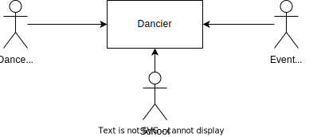

//:imagesdir: ../images

[[section-system-scope-and-context]]
== Context

=== Business Context

[options="header", cols="1,5"]
|===
|Neighbor| Description

| Dancer
| Individuals who engage in dancing, seeking fellow dancers and dance-related information. The system is designed to accommodate at least 10,000 dancers.

| School
| Institutions providing dance courses, workshops, and other dance-related activities. They utilize Dancier as a platform to connect with dancers and promote their activities.

| Event Organisers
| Organizers of various dance-related events use Dancier as a means to connect with potential participants.

|===

=== Technical Context

image:technical-context.drawio.svg[]

[options="header", cols="1,5"]
|===
| Neighbor | Description
| SMTP-Server | Used to send emails to stakeholders
| Web-Client | Each Stakeholder will access Dancier through a dedicated web application via a web client (web browser).
|===
