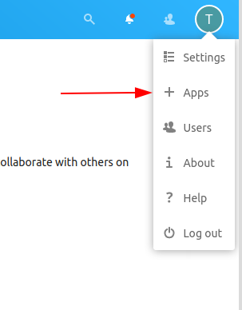
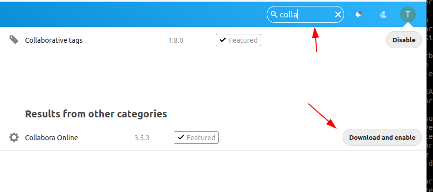
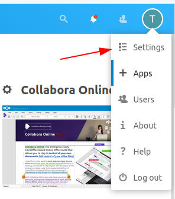
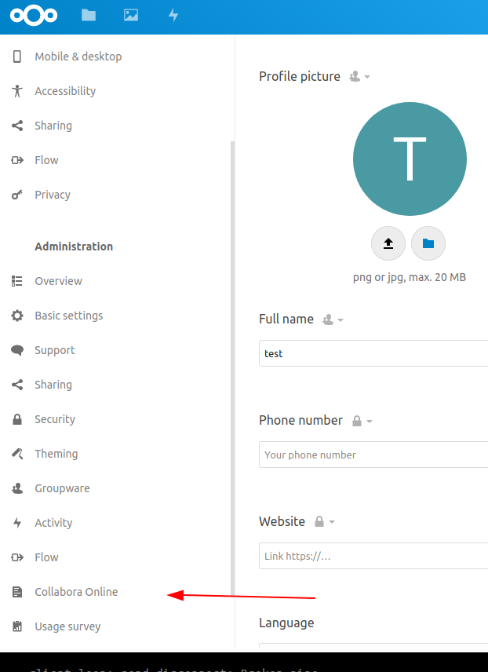
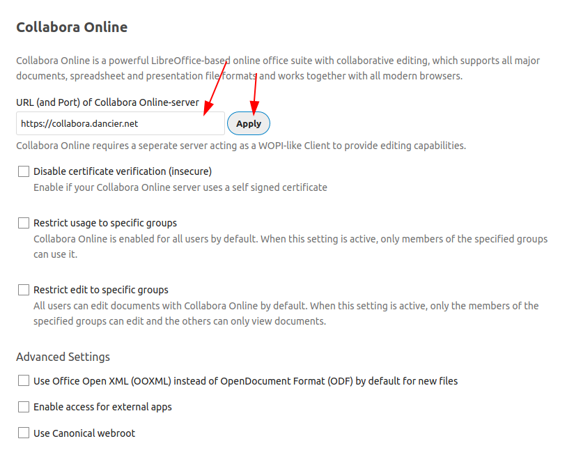
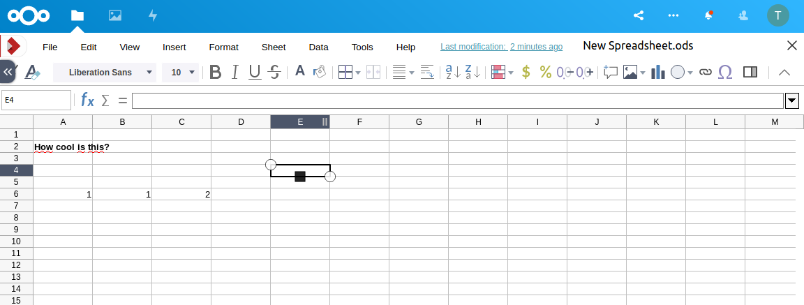

= Setting up your own Nextcloud with Collabora Office
:jbake-type: page
:jbake-status: published
:jbake-date: 2020-03-31
:jbake-tags: nextcloud, traefik, docker, docker-compose, collabora, code, cloud, letsencrypt,  ssl, office, backup, ubunutu, linux
:jbake-description: How to setup you Nextcloud with docker, traefik, Collabora, office and letsencrypt
:jbake-author: Marc Gorzala
:jbake-disqus_enabled: true
:jbake-disqus_identifier: f184187c-69d1-11ea-b388-87b974545588
:idprefix:
:sectnums:
:sectnumlevels: 5

Author: Marc Gorzala

link:https://github.com/dancier/documentation/edit/master/src/main/jbake/content/documentation/howto/nextcloud/index.adoc[Edit This Document]

image::nextcloud-logo-white.png[align="center"]

This post explains how you _could_ setup your own link:https://nextcloud.com/[Nextcloud]
with link:https://www.collaboraoffice.com/code/[Collabora Office] having SSL automatically managed via
link:https://letsencrypt.org[Letsencrypt] and link:https://containo.us/traefik/[Traefik].

*What is Nextcloud?*

Nextcloud offers you to host a service like link:https://www.dropbox.com/[DropBox].

You can have you files synced between different devices like your Desktop/Laptop and
mobile. Additionally you have also a calendar, a todo-list, your contacts and many other things synced
across your devices.

*What is Collabora?*

link:https://www.collaboraoffice.com/code/[Collabora], offers you the functionality of link:https://www.libreoffice.org/[Libre Office]
in your browser. In this tutorial we will integrate Collabora into your Nextcloud
installation, so that you can edit office documents directly in your Nextcloud!

*The installed system will...*

* ... use link:https://de.wikipedia.org/wiki/Hypertext_Transfer_Protocol_Secure[HTTPS]
  to secure the communication with your Nextcloud.
* ... include the Office Suite  link:https://www.collaboraoffice.com/code/[Collabora Office]
* ... separate Code/App from your data, making it easy for you to
** make backups (we will have a basic script for doing backups).
** perform updates.
* ... works behind a (DSL) router as well as on any other server in the cloud
  or elsewhere.

Ready to go? Great!

---

:toc:
:toc-placement: macro
:toclevels: 4
toc::[]

== Prerequisites

* A server that is able to run link:https://www.linux.org/[Linux]
  (this post will assume you are using a Debian/Ubuntu based distribution).
* You have control over DNS entries for a domain that you own. In this tutorial I will assume that
  you will use link:https://en.wikipedia.org/wiki/Subdomain[Subdomains] under `dancier.net`:
** `cloud.dancier.net` - pointing to your Nextcloud installation
** `collabora.dancier.net` - pointing to the installation of the office suite.
  (If you do not want to install the option for editing office files, you do not need this of course)
+
NOTE: The way we are installing the system is that everything is installed on the same machine
      and we need only one IP-address. So both domain names point to this one address.

* Basic knowledge of link:https://en.wikipedia.org/wiki/Linux[Linux] and link:https://www.docker.com/[Docker].

== We will use the following technologies

* link:https://www.docker.com/[Docker] for easy installation/updating of the needed
       software.
* link:https://docs.docker.com/compose/[Docker Compose] for a convenient configuration
       of the docker containers.
* link:https://docs.traefik.io/[Traefik] for automatically maintaining SSL Certificates
       and forwarding requests to either Nextcloud or Collabora Online. In this way it acts
       as an link:https://docs.docker.com/install/linux/docker-ce/ubuntu/[Reverse Proxy].
* link:https://mysql.com/[MySQL] to be used as the database for Nextcloud.
* link:https://www.collaboraoffice.com/code/[Collabora Office]

== Architectural Overview
[[architectural-overview]]
.architectural overview
[plantuml, cloud-architecture, svg]
....
@startuml
 left to right direction
 actor user
 component browser
 boundary wlan_router
 cloud docker {
   database db
   boundary reverse_proxy
   node nextcloud
   node collabora
 }
user --> browser
browser --> wlan_router
wlan_router --> reverse_proxy
reverse_proxy --> nextcloud
reverse_proxy --> collabora
nextcloud --> db

@enduml
....

Let me short describe you this architecture briefly.

. The `user` that is connecting to nextcloud.
. He is using a `browser` (or any other device/app) to make a connection
. The browser connects to the `wlan_router` at your home. This is your
  only component with a public IP-address. The `wlan_router` is configured
  to link:https://en.wikipedia.org/wiki/Port_forwarding[forward every traffic]
  that it receives on its public IP-address on
  Port 443 (the HTTPS port) to the IP-address of you local machine that
  will host your Nextcloud installation on Port 443(to the `reverse_proxy`).
+
NOTE: If you are installing Nextcloud on a server that is directly
      connected to the internet, then this component does not exist,
      and the browser directly connects to the `reverse_proxy`. +
      In this case you of course also need not to configure the mentioned
      port forwarding.
. The `reverse_proxy` is receiving the incoming traffic. It
  will inspect the request to find out to which host it should forward the request to.
+
TIP: If you want to know how the `reverse_proxy` could do this, as the Request is
encrypted, you can read link:https://cwiki.apache.org/confluence/display/HTTPD/NameBasedSSLVHostsWithSNI[this].
(It is using link:https://en.wikipedia.org/wiki/Server_Name_Indication[SNI])
. The `nextcloud` node contains just what the name implies. The main
  program. It will store all your files locally to this.
. The `db` node is the database that is used by `nextcloud` to store everything but files
  (contacts, calendar, ...)
. `collabora` contains the office suite.

Everything that is depicted in the cloud `docker` will be installed on one (docker-)host.

== Setting it up
First of all, we will make sure traffic to our planned domains `cloud.dancier.net`
and `collabora.dancier.net` could reach our system.

=== Check your DNS/IP configuration

All incoming traffic has to reach the `reverse_proxy`. So the DNS should normally
point to the machine you are going to install the system.

TIP: In case you are installing the system on a host behind a `wlan-router`
     (as depicted in above architecture diagram)
     than you have to find out the public IP-address of the router. Use
     this IP-address to configure your DNS entries and forward all traffic
     that reaches your `wlan-router` on PORT 443 to the machine in your
     local net where you are going to install Nextcloud.
     +
     Google for <router brand/type> port forwarding how to do this.

Assuming that the public IP-address is `5.61.144.190` you should get
the following responses when invoking a `nslookup` on the domains:

[source, bash]
----
marc@marc-VirtualBox:~/programm/dancier/documentation$ nslookup cloud.dancier.net
Server:   127.0.0.53
Address:  127.0.0.53#53

Non-authoritative answer:
Name:	 cloud.dancier.net
Address: 5.61.144.190

marc@marc-VirtualBox:~/programm/dancier/documentation$ nslookup collabora.dancier.net
Server:   127.0.0.53
Address:  127.0.0.53#53

Non-authoritative answer:
Name:	 collabora.dancier.net
Address: 5.61.144.190
----

=== Installing basic tools that you need

You need the following tools on the server you are going to install Nextcloud.

 * docker
 * docker-compose
 * git
 * vim (not necessarily needed, but good to have ;-) )

You can install the tools on your own, or you can download my script and
execute it on a freshly installed Ubuntu-Host that should serve the
Nextcloud installation.
This script installs all the needed tools and clones the project-repository
containing the whole setup for Nextcloud.

The next section will assume the script has been run successfully or at least you have
performed the equivalent steps manually.

Get the script here:

`https://raw.githubusercontent.com/gorzala/nextcloud/master/bootstrap-os.sh`

Copy this script to your server (or download it from there) and execute it.

NOTE: If this script will not run on your system, it could give you hints how to install
      the tools. Just do manually what the script would do for you an a compatible system ;-)

=== Inspecting the project

Check the clone project from:  `/root/nextcloud/`:

[source, bash]
----
root@cloud:~/nextcloud# ls -la
total 48
drwxr-xr-x 4 root root 4096 Mar 20 14:28 .
drwx------ 6 root root 4096 Mar 20 14:28 ..
-rwxr-xr-x 1 root root 1113 Mar 20 14:28 bootstrap-os.sh
-rw-r--r-- 1 root root 2379 Mar 20 14:28 docker-compose.yml
-rwxr-xr-x 1 root root  119 Mar 20 14:28 .env-template
drwxr-xr-x 8 root root 4096 Mar 20 14:28 .git
-rw-r--r-- 1 root root   86 Mar 20 14:28 .gitignore
-rwxr-xr-x 1 root root 3250 Mar 20 14:28 maintenance.sh
-rw-r--r-- 1 root root 5708 Mar 20 14:28 README.adoc
drwxr-xr-x 3 root root 4096 Mar 20 14:28 update
----

Brief description of the purpose of the files:

 * *bootstrap-os.sh* the script that you maybe already used to install basic tools for this project
 * *docker-compose.yml* configures all the containers that we use and how they work together
 * *.env-template* template for the config file that will hold your database credentials
 * *.git* and *.gitignore* git internals, you can ignore them
 * *maintenance.sh* the script for doing a backup and update (not yet complete)
 * *README.adoc* very short explanation how to use this project
 * *update* folder that belongs to updating the system. Maybe not really needed.

You will configure almost everything with `.env-template`, so we will start with have a short look
into this file.

I think you really need to understand what you are going to install. Latest in case, when something
goes wrong, it is better to not start trying to understand the system, just then.

If you are really impatient you can try to skip directly over to section <<section-configuring-system>>.
In this case I wish you a good luck. But consider at least coming back to the more detailed
explanations later.

==== The main configuration-file `.env-template`
This file contains variables that will be used in other scripts. So you need to declare them
only in one central file.

To get an idea, see one example content of such a file. It is not needed that you
understand all the variables just now. They will be explained in later sections.
It is enough for you to briefly have a look on them and know that:

1. a line starting with a `#` introduces a comment, so will not be used by other scripts
1. a variable definition is of the following format <variable-name>=<value>

[source, bash, linenumbers]
----
#### Traefik
TRAEFIK_IMAGES=traefik:v2.2
TRAEFIK_LOG_LEVEL=DEBUG

#### Letsencrypt
# Needed for getting ssl-certificates
ACME_MAIL=yourmail@address.de
# Stores the ssl-certificates
VOLUMES_LETSENCRYPT=./letsencrypt

#### Nextcloud
NEXTCLOUD_IMAGE=nextcloud
NEXTCLOUD_ADMIN_USER=test
NEXTCLOUD_ADMIN_PASSWORD=secrect
NEXTCLOUD_VOLUMES_CORE=./nextcloud-core
NEXTCLOUD_VOLUMES_APPS=./nextcloud-apps
NEXTCLOUD_VOLUMES_DATA=./nextcloud-data/
NEXTCLOUD_VOLUMES_CONFIG=./nextcloud-config
NEXTCLOUD_HOSTNAME=cloud.dancier.net
NEXTCLOUD_TRUSTED_DOMAINS=cloud.dancier.net

#### MySQL
MYSQL_IMAGE=mariadb:latest

MYSQL_VOLUMES=./nextcloud-mysql

MYSQL_ROOT_PASSWORD=<your-my-sql-root-passwort>
MYSQL_PASSWORD=<the password for accessing the database for nextcloud>

#### Collabora
COLLABORA_IMAGE=collabora/code
COLLABORA_DOMAIN=cloud\\.dancier\\.net
COLLABORA_HOST=collabora.dancier.net
----

==== Composing your services with docker-compose.yml
You need some knowledge of, how docker-compose works, to not break things unintentionally.

First of all be aware that name of the folder that contains the docker-compose file is *important*.
Docker-compose will use the name of this folder to create things like networks and others for you.
If you have cloned the project like I told you, this name is `nextcloud`.

So, names of created networks and containers will start with this name. So better do not change
the name of this folder!

In general, you can think of docker-compose as a way to configure different services that
should act together to fulfill a certain use case. In this case it is, having a full featured
Nextcloud installation with an office suite running.

The different services in our case are:

Traefik::        that acts as the reverse proxy, forwarding incoming requests to the different internal systems
Nextcloud::      that is our main component
Mysql database:: that stores all the data for and is used by the Nextcloud service
Collabora::      the service used to provide the office suite

So already four services!

Those services will communicate with each other as shown in  <<architectural-overview, figure 1>>.
The service-to-service communication happens via a private network that docker-compose will create for you.
With this private network, this communication between these services is shielded from the rest of
the docker-host (and with this also from the internet).

So let's see how these four services are configured:

NOTE: The compose-file is being written in link:https://yaml.org/[Yaml]-Syntax. This is becoming
      someway standard for more and more systems. So if you are not familiar with how to write
      YAML files, learning this will pay off not only for writing docker-compose files.

Let's see the basic structure of the docker-compose file:

.docker-compose.yml (schema)
[source, bash, linenumbers]
----
version: "3"
services:
  traefik:
    [...]
  nextcloud:
    [...]
  mysql:
    [...]
  collabora:
    [...]
----
line 1:: *Version* +
  Specifies that we are using version 3 of the compose file syntax. (This is not the version of
  docker-compose or docker)
line 2:: *Definition of the services* +
  Starts with the the services that we will use. Under this node all services are configured.

In the following we will have a deeper look into the configuration of each service. Some
configurations directives like naming will be explained only once and not for every service, as this
would be to verbose. However, due to this you should read through all the
parts one by one.

===== Traefik
.docker-compose.yml (Traefik part)
[source, bash, linenumbers]
----
  traefik:
    image: ${TRAEFIK_IMAGES}
    command:
      - "--log.level=${TRAEFIK_LOG_LEVEL}"
      - "--providers.docker=true"
      - "--providers.docker.exposedbydefault=false"
      - "--entrypoints.websecure.address=:443"
      - "--certificatesresolvers.mytlschallenge.acme.tlschallenge=true"
      #- "--certificatesresolvers.mytlschallenge.acme.caserver=https://acme-staging-v02.api.letsencrypt.org/directory"
      - "--certificatesresolvers.mytlschallenge.acme.email=${ACME_MAIL}"
      - "--certificatesresolvers.mytlschallenge.acme.storage=/letsencrypt/acme.json"
    restart: always
    ports:
      - "443:443"
    volumes:
      - "${VOLUMES_LETSENCRYPT}:/letsencrypt"
      - "/var/run/docker.sock:/var/run/docker.sock:ro"
----

This part configures Traefik, which is our `reverse_proxy`, that forwards all incoming
requests to the other services (see <<architectural-overview>>).

line 1:: *Name* +
         Sets the service-name to 'traefik'. As we do not specify a container name explicitly,
         docker-compose will generate this name: _nextcloud_traefik_1_. Compose will the take
         the name of the folder that contains the compose file, concatenates it with the name
         of the service and a number for that node(we will have only one noce per service, so
         this will be always 1)
line 2:: *Docker image* +
         defines which link:https://hub.docker.com/_/traefik[docker image] to get for traefik. +
         This is made configurable via a <<section-configuring-system, variable>>

lines 4-11:: *CLI parameters for Traefik* +
         In short: the configuration of traefik is being grouped into static configuration
         (everything that changes rarely(are we working with docker, or kubernetes,...) and
         dynamic configuration for the stuff that changes more frequently. +
         For the static configuration traefik offers three ways:
* File based configuration
* Environment variable configuration.
* _Command line parameter bases configuration_ (I choose to use this option)

line 4:: *Debug log-level* +
         This command-line parameter configured traefik to start in debug mode. This will
         increase the logging volume heavily. Use this when you have problems.
         This is commented out in this example.
line 5:: *Docker provider* +
         This will setup traefik to use the docker-plugin, the provider. Essentially this,
         makes Traefik listen to every container that is started/stopped by Docker.
         Whenever a container starts, it checks if this container is being configured to
         used with Traefik. If so, it creates a route so that incoming traffic will be
         forworded to this service/container. It will also make sure that a valid
         ssl-certifcate is being used.
line 6:: *Docker expose by default* +
         You explicitly have to enable containers to be handled by Traefik.
line 7:: *Entry points* +
         Makes Traefik creating an endpoint named 'websecure' that listens on port 443.
         Traefik will use this endpoint to handle all incoming traffic and route it to the
         respective containers (see <<architectural-overview, figure>>).
line 8-11:: *SSL-configuration* +
         Configures how Traefik should manage certificates. +
         One <<section-configuring-system, variable>> is also made configurable.
line 12:: *Restart always* +
         Makes Traefik always automatically restart, in case it crashes.
line 13 - 14:: *Ports* +
         We will only expose (listing on that port on the docker-host) port 443. This is the
         default for HTTPS/SSL
line 15 - 17:: *link:https://docs.docker.com/storage/volumes/[Volumes]* +
         * The Letsencrypt volume is used to store the SSL-certificate related things'. +
           This is made configurable via a <<section-configuring-system, variable>>.
         * Docker link:https://en.wikipedia.org/wiki/Unix_domain_socket[socket] is someway special: +
           It enables the traefik container to connect to the mentioned socket on the docker-host.
           By connecting to this socket, Traefik is aware of all containers that are started and stopped.
           You will see later why this is important.

===== Nextcloud
.docker-compose.yml (Nextcloud part)
[source, bash, linenumbers]
----
  nextcloud:
    image: ${NEXTCLOUD_IMAGE}
    environment:
      - MYSQL_DATABASE=nextcloud
      - MYSQL_USER=nextcloud
      - MYSQL_HOST=mysql
      - MYSQL_PASSWORD
      - NEXTCLOUD_ADMIN_USER
      - NEXTCLOUD_ADMIN_PASSWORD
      - NEXTCLOUD_TRUSTED_DOMAINS
    restart: always
    volumes:
      - ${NEXTCLOUD_VOLUMES_CORE}:/var/www/html
      - ${NEXTCLOUD_VOLUMES_APPS}:/var/www/html/custom_apps
      - ${NEXTCLOUD_VOLUMES_DATA}:/var/www/html/data
      - ${NEXTCLOUD_VOLUMES_CONFIG}:/var/www/html/config
    labels:
      - "traefik.enable=true"
      - "traefik.http.routers.nextcloud.rule=Host(`${NEXTCLOUD_HOSTNAME}`)"
      - "traefik.http.routers.nextcloud.entrypoints=websecure"
      - "traefik.http.routers.nextcloud.tls.certresolver=mytlschallenge"
      - "traefik.http.middlewares.nextcloud.headers.customresponseheaders.Strict-Transport-Security=max-age=15552000; includeSubDomains"
    depends_on:
      - mysql
      - traefik
----
line 3-16:: *Environment* +
  We are passing two environment variables into the Nextcloud-container...
    * the database name to be used to 'nextcloud'.
    * the database username to be used also to 'nextcloud'.
    * the hostname of the db, that we will connect to. Docker-compose, will create
      an internal network for all your services. In this network each service can find
      each other via it's service name. Docker provide an DNS-server that resolves those
      names correct.
    * MYSQL_PASSWORD +
      that is password nextcloud will use to connect to the database. We are not providing
      here a value. This will make docker-compose lookup a value from an environment. In
      our case those values will come from the <<section-configuring-system, configuration file>>.
    * NEXTCLOUD_ADMIN_USER +
      Nextcloud will be initialiased with an created user with this name. This user will
      have admin rights.
    * NEXTCLOUD_ADMIN_PASSWORD +
      The password for the aforementioned user.
    * NEXTCLOUD_TRUSTED_DOMAINS +
      the domain-name this installation feels responsible for (`cloud.dancier.net`)
lines 12 - 16:: *Volumes* +
 * nextcloud-core, this will contain the core part of nextcloud
 * nextcloud-app, this will hold your installed apps (kind of extensions of nextcloud)
 * nextcloud-data, this very likely to be the volume that has to store most.
 * nextcloud-config, this will contain the configuration files the will be read by Nextcloud

lines 12 - 17:: *Labels* +
* *traefik.enable* +
   as I told you in the description of the Traefik-Service, Traefik will be informed by every start and stop of a
   docker container. I will also be able to read the labels associated with the containers. By reading this lable,
   we tell traefik to feel responsible to this service.
* *Rule* +
   This is also read by Traefik and tells it to forward all traffic that has the HTTP-host header set to
   the configurable value to this service.
* *Entry point* +
   Traefik will use this named endpoint (see configuration for Traefik) to consider traffic for Nextcloud
* *Certresolver* +
   Defines which certifcate-generation strategy should be used (we configured also this in the Traefik-part)
* *Strict-Header*
  *Tried to circumvent an error message in the nextcloud backend*

lines 18 - 20:: *Depends on* +
    * Nextcloud needs to have traefik running before being started, as traefik would not be able to configure ssl when it
    starts after nextcloud
    * Nextcloud needs a running database, so we also wait until it is started.

[[mysql]]
===== MySQL
.docker-compose.yml (MySQL part)
[source, bash, linenumbers]
----
  mysql:
    image: ${MYSQL_IMAGE}
    command: --transaction-isolation=READ-COMMITTED --binlog-format=ROW
    volumes:
      - ${MYSQL_VOLUMES}:/var/lib/mysql
    environment:
      - MYSQL_ROOT_PASSWORD
      - MYSQL_PASSWORD
      - MYSQL_DATABASE=nextcloud
      - MYSQL_USER=nextcloud
----
line 3:: *CLI-Parameter* +
 * link:https://dev.mysql.com/doc/refman/8.0/en/innodb-transaction-isolation-levels.html[Database Transaktion level]
    set to `READ_COMIITTED`
 * link:https://mariadb.com/kb/en/binary-log/[Binlog] set to row

+
This is prescribed in link:https://docs.nextcloud.com/server/latest/admin_manual/configuration_database/linux_database_configuration.html[Nextcloud-Admin-Configuration]

lines 6 - 10:: *Environment* +
You, should notice that we configure four environment variables here.
Two of them already with a concrete value
 * MYSQL_DATABASE=nextcloud
 * MYSQL_USER=nextcloud
+
This, configures MYSQL to create a database named 'nextcloud' with a user of the same name, that has
all rights on the database 'nextcloud'.
The creation of the database happens only it does not already exist.
The corresponding passwords are taken from the next two environment variables.
 * MYSQL_ROOT_PASSWORD
 * MYSQL_PASSWORD
+
They do not have any values. In such a case docker, compose will take them from a file named `.env` in the
current directory (this could also be overwritten by CLI parameters when invoking docker-compose, but in
our case we do not care).
In the configuration part, I will tell you how to set up this file.

===== Collabora
.docker-compose.yml (Collabora part)
[source, bash, linenumbers]
----
  collabora:
    image: ${COLLABORA_IMAGE}
    restart: always
    environment:
      - domain=${COLLABORA_DOMAIN}
      - DONT_GEN_SSL_CERT=YES
      - extra_params=--o:ssl.enable=false --o:ssl.termination=true
    depends_on:
      - traefik
    cap_add:
      - MKNOD
    labels:
      - "traefik.enable=true"
      - "traefik.http.routers.collabora.rule=Host(`${COLLABORA_HOST}`)"
      - "traefik.http.routers.collabora.entrypoints=websecure"
      - "traefik.http.routers.collabora.tls.certresolver=mytlschallenge"
----
lines 4 - 6:: *Environment* +
              * *domain*, the DNS name of the Nextcloud installation
              * *DONT_GEN_SSL_CERT*, SSL certifcate management is handeled by Traefik
              * *extra_params*
              ** as Traefik will terminate SSL (only HTTP reaches this
                 service, not HTTPS), we disable ssl here
              ** we indicate, that SSL was used, but terminated (likely
                 used for link generation, i guess)

+
see link:https://www.collaboraoffice.com/code/docker/[this page] on Collabora Onlline for more help.
lines 9:: *Depends on* +
 ...Traefik for SSL-management.

lines 9-10:: *Adding capablities* +
 MKNOD enables the collabora container to create devices nodes. This could be dangerous (link:https://systemadminspro.com/docker-container-breakout/[link])
 Do we really need this. The Nextcloud documentation comes with examples, containing this
 directive, collabora comes without it. I will try in the future to run without it.
 If you successfully run collabora without this being set, please use the comments to tell me.

==== Maintaining the system with maintenance.sh
This script should cover all maintenance tasks for you while operating
your Nextcloud installation.

Currently, only a simple backup functionality is being implemented. You should
do a backup especially before every update.

We will explain the usage of this script after we had configured it.

[[section-configuring-system]]
=== Configuring the system

Now you should have at least an understanding, about the important files.
You also have made sure, that the DNS names point to the correct IP-address.

Not we are making our fingers wet, change a file and start the system!

==== Creating and editing `.env`
You see in the root-directory of the project a file called `.env-template`. As the
name implies, this is only a template. Let's create a nontemplate from this.

[source, bash]
----
root@cloud:~/nextcloud# cp .env-template .env
----

Now edit the file (I would suggest to use vim). You will have to adapt at least, the
domain names to match your needs. I tried to use self explaining varibale names with
additionally help of comments where I considered the name as not explaining enough.

(In case of questions, just use the comments under this howto. I will give my best to help you).

==== First start of the system
Now everything should be fine.

You have an `.env` file with updated values where it this was needed.

So give it a try and start the system!

[source, bash]
----
# in the project folder
cd /root/nextcloud
docker-compose up
----
This first run will take some time. At an essence the following time-consuming things happen:
* all docker image will be downloaded from docker (we have 4 services, so this is not few data)
* the ssl certifcates will be created

You may have realized that the docker-compose command does not return to your terminal. If you
want to stop docker, than you have to type `CTRL`+`C`. (But do not stop it now! If you already
have stopped it, just restart with `docker-compose up` and continue reading.)

Later we will start docker compose in the background.

When you do not see any progress on the console, that you can safely assume that everything has
been downloaded, and the SSL-certificates are in place.

Not open a browser and open `https://cloud.dancier.net` to intialize Nextcloud.
If you get an HTTP 502 (Bad Gateway), than you have not waited long enough. Just wait one or two minutes more.

Then you should get another error message ;-)

The reason is, that the default config will make Nextcloud generating redirect links to the
HTTP Version (the non SSL/HTTPS) of the links. On this links, no service is being configured,
so you will see an error page of the browser.

You have to change the config of Nextcloud to fix this. This will be explained in the
next section.

==== Change config.php

You can stop the running docker-compose setup by typing `CTRL` + `C`.
Check which directories are now existing. You will see that docker compose has created one for each volume
that we have configured. And these folder are also not empty, they contain the mounted files
from the docker containers.

Edit the file `./nextcloud-config/config.php`.

Make sure the following keys exist one time and have the following values (and use your brain to use your hostnames ;-)

[source, bash]
----
'overwritehost' => 'cloud.dancier.net',
'overwriteprotocol' => 'https',
'overwrite.cli.url' => 'https://cloud.dancier.net',
----

Now if you open again `https://cloud.dancier.net` (really use the https) than you
should be able to login!

Login in with the values `NEXTCLOUD_ADMIN_USER` and `NEXTCLOUD_ADMIN_PASSWORD` from your `.env` file.

==== Install/Configure the collabora office plugin

You have now a running collabora-office server running. What is missing, is
to install the appropiate plugin/app for Nextcloud.

1. First login into Nextcloud with your Browser
1. In to top right corner open the configuration menu

== Do your first backup

== Some problems that you may have

https://github.com/jowave/vcard2to3

2.1 3.1

== Summary
If you like this How two, link me, show it in the comments! Also, use the comments in case
of questions.

Let's summarize what he have achieved:

* We have an own Nextcloud installation running
* Everything is reachable via valid SSL certificates
* We can sync with Desktops running Windows/Mac and Linux
* We can also sync with mobiles running Android/Mac
* We have an office suite, that enable us to work wherever we are
* We can also easily work together on the very same document at the very same time!

*I hope you like this tutorial and recommend it!*
