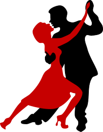

= Connecting people through dance
:jbake-type: page
:jbake-status: published
:jbake-tags: dance
:idprefix:

The Purpose of this project is manifold:

Connect People via dance::
do everything we can do, to ease pursuing the hobby to dance

Having a holistic learning experience::
Working in the project enables every team member to contribute in as
many areas that he is willing to contribute:
 * *Software engineering*
 ** _Software architecture_
 ** _Backend development_
 ** _Frontend development_
 * *Design* +
 ** _Webdesign_
 ** _Advertisment_
 * *Project Management*
 ** _Document the project_
 ** _Steer the project_

Provide reusable examples for the community::
 * All code is Open Source
 * All design is Open Source
 * The whole project plan is open

By this we are providing public accessible examples that hopefully can
help others to eg. setup a Software project on it's own and can use this
as guidance.

== How to participate

please read link:technology/index.html[Technology Base] to check if we are
already using something where you can contribute.

Contributing is not only possible by technical help. You can also:

* Help us with design in general
* Help us with translations
* Promote us, eg. tell friends that look for dance partners, connect us to dancing schools, distribute fliers ... , share us on instagramm, facebook,...
* Donate money
