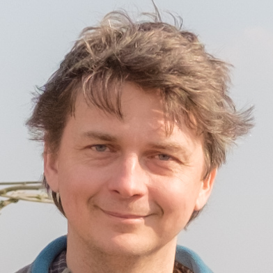
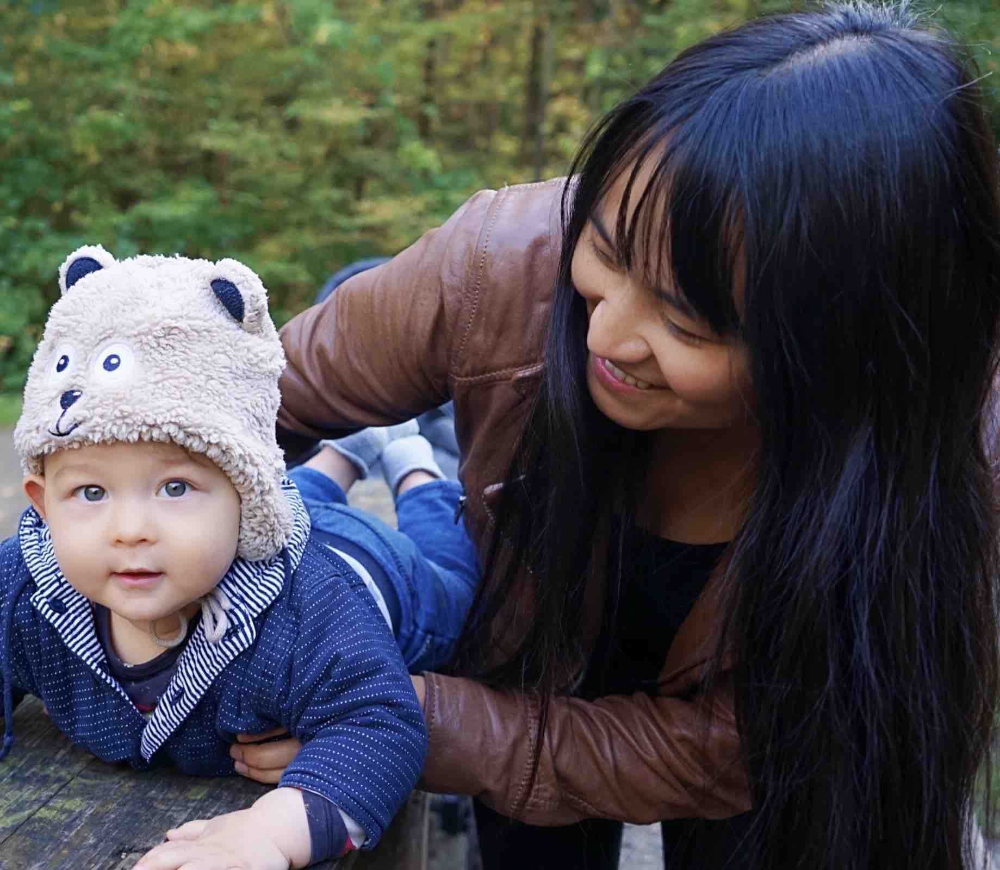
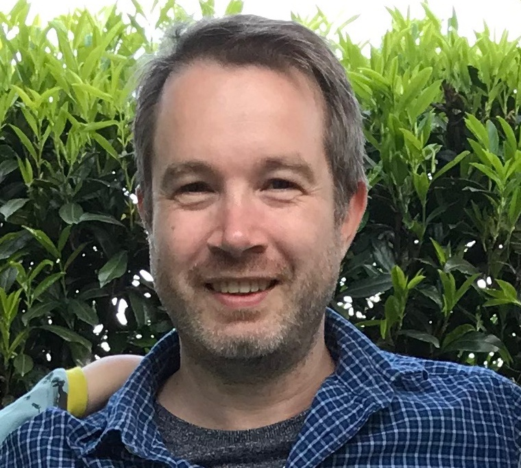

= Core team
:jbake-type: page
:jbake-status: published
:jbake-date: 2023-03-14
:jbake-tags: team, project, members
:jbake-description: Core members of the team
:idprefix:

We are dancier!

---

[stripes=odd, frame=none, cols="2"]
|===
a|link:https://twitter.com/MarcGorzala[Marc Gorzala]

* Backend Engineer
* Whole Architecture
* Product Vision
* Founder

|Dominik Halfkan

 
| Xiaofei Gorzala

|link:https://twitter.com/jans0510[Jan Stroppel]

|===
