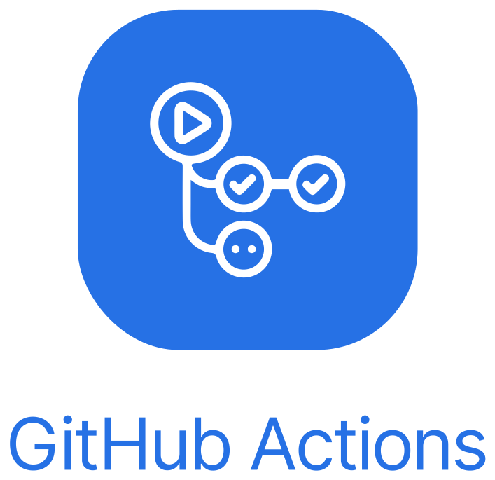
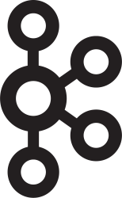

= Our technology stack
:jbake-type: page
:jbake-status: published
:jbake-date: 2023-03-02
:jbake-tags: desgin pattern, architecture, java, kiss, agile, decision making
:jbake-description: Describe how we are making (not only technial) decisions
:jbake-disqus_enabled: true
:jbake-disqus_identifier: 6402d4ec-69e1-11ea-8a83-5f9a72c4b212
:idprefix:

This is about the set of technologies we agreed on.

It's a result of applying our https://project.dancier.net/technology-decision-principles.html[Technology Decision Principles].

== Backend/Data Science
---

[stripes=odd, grid=cols, frame=none, cols="2"]
|===
|Java +
 for general programming | 
 Python + 
 for data-related tasks and scripting |
https://dev.java/[
image:./images/logo-java.svg[alt="Java Logo",  width=100, height=100]]|
https://www.python.org/[
image:./images/logo-python.svg[alt="Python Logo",  width=100,height=100]]

|Spring Boot +
 for Java microservices | 
 Flask +
 for Python microservices|

https://spring.io/projects/spring-boot[
image:./images/logo-spring-framework.svg[Spring Framework Logo, width=100, height=100]] |
https://flask.palletsprojects.com/en/2.2.x/[
image:./images/logo-flask.svg[alt="Flask Logo",  width=100, height=100]]

|===

== Frontend
---

[stripes=odd, grid=cols, frame=none, cols="2"]
|===
|Javascript| Typescript
|https://developer.mozilla.org/en-US/docs/Web/JavaScript/Reference?retiredLocale=de[
image:./images/logo-javascript.svg[alt="Javascript Logo",  width=100, height=100]]
|
https://www.typescriptlang.org/[
image:./images/logo-typescript.svg[alt="Typescript Logo",  width=100, height=100]]
|Angular + 
For our Single Page Application|  |
https://angular.io/[
image:./images/logo-angular.svg[alt="Angular Logo",  width=100, height=100]] |
|===

== Infrastructure
---

[stripes=odd, grid=cols, frame=none, cols="2"]
|===
|PostgreSQL +
 as our default database| Docker +
 for containerization
|https://www.postgresql.org/[image:./images/logo-postgresql.svg[alt="PostgreSQL Logo",  width=100, height=100]]
|https://www.docker.com/[
image:./images/logo-docker.png[alt="Docker Logo", width=200, height=100]]

|Cloud Init  +
for bootstrapping cloud instances| Docker-Compose + 
for development and deployment 
|https://cloud-init.io/[
image:./images/logo-cloud-init.svg[alt="Cloud Init Logo", width=200, height=100]]
|https://docs.docker.com/compose/[
image:./images/logo-docker-compose.png[alt="Docker Compose Logo", width=200, height=100]]
 

|S3 - Minio +
our S3 Bucket Implementation| Keycloak + 
our Iam System
|https://min.io/[
image:./images/logo-minio.png[alt="Minio Logo", width=100, height=100]]
|https://www.keycloak.org/[
image:./images/logo-keycloak.png[alt="Keycloak Logo",  width=100, height=100]]

|Nginx + 
for delivering our Angular App| Hetzner Cloud +
Our cloud provider
|https://www.nginx.com/[
image:./images/logo-nginx.png[alt="Nginx Logo", width=100, height=100]]
|https://www.hetzner.com/cloud[
image:./images/logo-hetzner.svg[alt="Hetzner Logo", width=100, height=100]]

|Elastic Stack + 
for monitoring and logging| Traefik + 
Traffic routing and SSL-Handling
|https://www.elastic.co/[
image:./images/logo-elasticsearch.svg[alt="Elastic Logo", width=200, height=100]]
|https://doc.traefik.io/traefik/[
image:./images/logo-traefik.png[alt="Elastic Logo", width=200, height=100]]

|GitHub +
Version control/Tickets
|GitHub Actions + 
CI/CD
|https://github.com/[
image:./images/logo-github.png[alt="Github Logo", width=100, height=100]]
|https://github.com/features/actions[]

|Apache Kafka +
for messaging|
|https://kafka.apache.org/[
]|
|===

== Organisational
---

[stripes=odd, grid=cols, frame=none, cols="2"]
|===
|Nextcloud + 
Project coordination
| Collabora Office + 
Project coordination
|https://nextcloud.com/[image:./images/logo-nextcloud.svg[alt="Nextcloud Logo", width=100, height=100]]
|https://www.collaboraoffice.com/collabora-online-3/[]

|Figma +
Prototyping UIs|Asciidoctor +
This kind of documentation
|https://www.figma.com/de/[
image:./images/logo-figma.svg[alt="Figma Logo", width=100, height=100]]
|https://asciidoctor.org/[
image:./images/logo-asciidoctor.svg[alt="Asciidoctor Logo", width=100, height=100]]
|===

