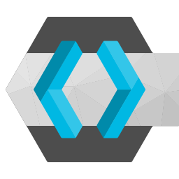

= Our technology stack
:jbake-type: page
:jbake-status: published
:jbake-date: 2020-02-23
:jbake-tags: desgin pattern, architecture, java, kiss, agile, decision making
:jbake-description: Describe how we are making (not only technial) decisions
:jbake-disqus_enabled: true
:jbake-disqus_identifier: 6402d4ec-69e1-11ea-8a83-5f9a72c4b212
:idprefix:

Let us show you roughly what are main techology stack is. We will not explain why we have chosen those on this page. This is subject to our https://project.dancier.net/documentation/arc42/index.html#section-architecture-constraints[Arc42 based Architecture Documentation].

== Backend/Data Science
---

[stripes=odd, grid=cols, frame=none, cols="2"]
|===
|Java for general tasks | 
 Python for Data related tasks and for scripting |

image:./images/logo-java.svg[alt="Java Logo",  width=100, height=100]|
image:./images/logo-python.svg[alt="Python Logo",  width=100,height=100]

|Boot for Java Projects | 
 Flask for Python Projects|

image:./images/logo-spring-framework.svg[Spring Framework Logo, width=100, height=100] |

|===

== Frontend
---

[stripes=odd, grid=cols, frame=none, cols="2"]
|===
|Javascript| Typescript
|image:./images/logo-javascript.svg[alt="Javascript Logo",  width=100, height=100]
|image:./images/logo-typescript.svg[alt="Typescript Logo",  width=100, height=100]
|Angular |  |
image:./images/logo-angular.svg[alt="Angular Logo",  width=100, height=100] |
|===

== Infrastructre
---

[stripes=odd, grid=cols, frame=none, cols="2"]
|===
|PostgreSQL Database| Docker
|image:./images/logo-postgresql.svg[alt="PostgreSQL Logo",  width=100, height=100]
|image:./images/logo-docker.svg[alt="Docker Logo", width=200, height=100]

|Cloud Init | Docker-Compose 
| 
| 
 

|S3 - Minio| IAM - Keycloak
|
|

|Nginx| Hetzner Cloud
|image:./images/logo-nginx.png[alt="Nginx Logo", width=100, height=100]
|image:./images/logo-hetzner.svg[alt="Hetzner Logo", width=100, height=100]

|Elastic Stack|
|image:./images/logo-elasticsearch.svg[alt="Elastic Logo", width=200, height=100]|

|GitHub|GitHub Actions
|image:./images/logo-github.png[alt="Github Logo", width=100, height=100]
|image:./images/logo-github-actions.svg[alt="Github Logo", width=100, height=100]
|===

== Organisational
---

[stripes=odd, grid=cols, frame=none, cols="2"]
|===
|Nextcloud| Collabora Offcie
|
|image:./images/logo-collabora-online.svg[alt="Collabora Logo", width=100, height=100]

|Figma|Asciidoctor
|image:./images/logo-figma.svg[alt="Figma Logo", width=100, height=100]
|image:./images/logo-asciidoctor.svg[alt="Asciidoctor Logo", width=100, height=100]
|===

== Key drivers for technical decisions

 1. *Any decision should be as little opinionated as possible* +
    We should never choose a technology just because we consider
    it eg. cool or only because we have experienced it as a good fit for _another_ use case.
    Decisions should be made depending on the use case. +
 2. *Keep it simple stupid (KISS)* +
    Based on our interpretation of
    https://en.wikipedia.org/wiki/Agile_software_development[Agile Development]
    we think that we should choose the https://en.wikipedia.org/wiki/KISS_principle[simplest] approach to tackle a task.
    Particularly, we always try to avoid optimizing things before it turns out
    that optimization is needed (https://ubiquity.acm.org/article.cfm?id=1513451[see Donald Knuth]).
    This applies, in the same way, to _small_ things eg.
     * optimizing algorithms like SQL-queries
     * choosing frameworks for persistence, offering rest endpoints, frontend frameworks
     * infrastructural topics like VCS build system +
+
As well as it applies to "bigger" things eg.
     * Deciding architectural things like using CQRS
     * Using microservices vs. putting things into a monolith
 1. *Best of breed* +
    Try to use standard options. Eg. when there are several similar web frameworks,
    go for the more prominent one. Because for the more prominent one we will
      * get more support from other developers if we run into problems
      * expect more support from the project itself, and also the project itself will exist longer
      * have better tooling support (if applicable)
      * have it easier to find more developers
 1. *Match techniques with skills of core team members* +
    The chosen technique should be either already known by the team (or part of the team) or the team must
    be willing to learn it.

It is obvious that some criteria could be in conflict with others. Then we use just common sense.
